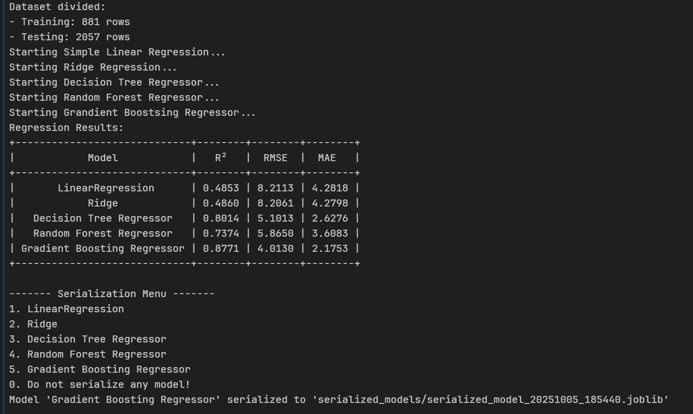

# ML Explorer  

<div align="left">

**Language:** [Español](#ml-explorer-espanol) | [English](#ml-explorer-english)

</div>

---

## ML Explorer Español

Este proyecto se centra en desarrollar una herramienta para realizar un **Análisis Exploratorio de Datos (EDA)** básico y posteriormente crear modelos de aprendizaje **supervisado** (regresión y clasificación) y **no supervisado**, que podrán ser serializados para su futuro uso.

Está construido bajo un paradigma de **Programación Orientada a Objetos (POO)**, donde existe una clase `Start()` que, al ser llamada, inicia la ejecución de **ML Explorer**.

### 📁 Estructura del proyecto
```
ML_EXPLORER/
│
├── 📂 datasets/              # Archivos de datos
├── 📂 serialized_models/     # Modelos entrenados
├── 📂 assets/                # Imágenes o GIFs de demostración
│   └── demo.png
│
├── 📓 ml_explorer.ipynb      # Notebook principal
├── ⚙️ pyproject.toml         # Configuración de Poetry
├── 🔒 poetry.lock            # Dependencias bloqueadas
└── 📘 README.md              # Documentación del proyecto
```

### 🤖 Modelos Utilizados

#### 🧩 No Supervisados
- K-Means  
- K-Medoids  
- HAC (Hierarchical Agglomerative Clustering)  
- UMAP + K-Means (reducción de dimensionalidad + agrupamiento)

#### 🎯 Clasificación
- Decision Tree  
- K-Nearest Neighbors (KNN)  
- Random Forest  
- AdaBoost  

#### 📈 Regresión
- Regresión Lineal Simple  
- Ridge Regression  
- Decision Tree Regressor  
- Random Forest Regressor  
- Gradient Boosting Regressor  

---

## 🖼️ Demo
Demostración de interfaz en terminal de **ML Explorer**:



---

## ⚙️ Correr localmente
Para Windows:

### 🧰 Requisitos

- Python >= 3.11  
- Poetry >= 2.0.0  
- Jupyter Notebook >= 7.4.2  

Para instalar **Poetry**, consulte la guía oficial:  
🔗 https://python-poetry.org/docs/#installing-with-pipx

Instala Jupyter Notebook con alguno de los siguientes dos comandos (Windows):

```bash
poetry add notebook
```
```bash
pip install notebook
```

### 📥 Clonar repositorio

```bash
git clone xxxx
```

### 🧩 Instalar dependencias

```bash
poetry install
```

### 🚀 Ejecución

Corra todos los bloques de ejecución de arriba hacia abajo hasta llegar a:
```python
# Starting program
start = Start()
start.run()
```
Al ejecutarlo, se mostrará el primer input para empezar a utilizar el notebook.

---

## 🧠 Tech Stack

**Lenguaje de programación**  
- Python 3.11

**Librerías y frameworks**  
- NumPy  
- Pandas  
- Scikit-learn  
- Scikit-learn-extra  
- UMAP-learn  
- Matplotlib  
- Seaborn  
- SciPy  
- PrettyTable  
- Joblib

**Entorno y herramientas**  
- Poetry (gestor de dependencias)  
- Jupyter Notebook  
- Git y GitHub

---

## ML Explorer English

This project focuses on developing a tool to perform a basic **Exploratory Data Analysis (EDA)** and then build **supervised** (regression and classification) and **unsupervised** learning models, which can be serialized for future use.

It is built under an **Object-Oriented Programming (OOP)** paradigm, where there is a main class called `Start()` that, when executed, initializes **ML Explorer**.

### 📁 Project Structure
```
ML_EXPLORER/
│
├── 📂 datasets/              # Data files
├── 📂 serialized_models/     # Trained models
├── 📂 assets/                # Demo images or GIFs
│   └── demo.png
│
├── 📓 ml_explorer.ipynb      # Main notebook
├── ⚙️ pyproject.toml         # Poetry configuration
├── 🔒 poetry.lock            # Locked dependencies
└── 📘 README.md              # Project documentation
```

### 🤖 Models Used

#### 🧩 Unsupervised
- K-Means  
- K-Medoids  
- HAC (Hierarchical Agglomerative Clustering)  
- UMAP + K-Means (dimensionality reduction + clustering)

#### 🎯 Classification
- Decision Tree  
- K-Nearest Neighbors (KNN)  
- Random Forest  
- AdaBoost  

#### 📈 Regression
- Simple Linear Regression  
- Ridge Regression  
- Decision Tree Regressor  
- Random Forest Regressor  
- Gradient Boosting Regressor  

---

## 🖼️ Demo
Command-line demo of **ML Explorer**:


---

## ⚙️ Run Locally
For Windows:

### 🧰 Requirements

- Python >= 3.11  
- Poetry >= 2.0.0  
- Jupyter Notebook >= 7.4.2  

To install **Poetry**, see the official guide:  
🔗 https://python-poetry.org/docs/#installing-with-pipx

Install Jupyter Notebook with one of the following commands (Windows):

```bash
poetry add notebook
```
```bash
pip install notebook
```

### 📥 Clone Repository

```bash
git clone xxxx
```

### 🧩 Install Dependencies

```bash
poetry install
```

### 🚀 Execution

Run all code blocks from top to bottom until you reach:
```python
# Starting program
start = Start()
start.run()
```
Once executed, the first input will appear to begin using the notebook.

---

## 🧠 Tech Stack

**Programming Language**  
- Python 3.11

**Libraries and Frameworks**  
- NumPy  
- Pandas  
- Scikit-learn  
- Scikit-learn-extra  
- UMAP-learn  
- Matplotlib  
- Seaborn  
- SciPy  
- PrettyTable  
- Joblib

**Environment and Tools**  
- Poetry (dependency manager)  
- Jupyter Notebook  
- Git and GitHub
